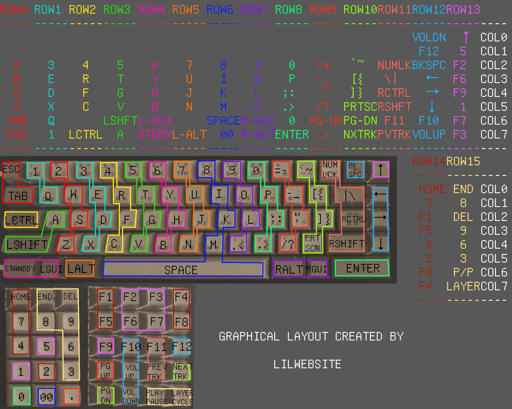

# promicro-keyboard-firmware
Keyboard firmware written in C using avr-libc, designed for the pro micro MCU (ATmega32U4)

# What this is

This program is a firmware driver for keyboards, at the moment only supporting the IBM Pingmaster line of keyboards, and is used to make promicro or similar a drop in replacement for the existing microcontroller attached to the keyboard.

This program was written to work with the Pingmaster, but there are many keyboards that can work using this firmware so it is possible to use it on most keyboards, with a few modifications. Feel free to use this software for whatever you like, everything is MIT licensed.

## Features
- Supports NKRO **[1]**
- Supports built in macros
- Layer support
- Supports media keys, such as mute, volume up/down, pause/play, etc
- Firmware is easily updated, via DFU bootloader and a reset switch

**[1]** Technically supports N-key rollover, with up to 62 simultaneous keys plus all modifier keys being pressed at once. This limit can be raised to 126, for true NKRO, but I found it unessecary.

# Information on the firmware

## Keyboard layout, layer, and macro information

### Layout information

The pre-compiled firmware file **kbd.hex** comes with 2 layer modes and a QWERTY layout, where I tried to place the keys in seemingly the best positions possible after quite a bit of use and testing.

### Layer information

If you bring your attention to the graphical layouts below, the first layer numpad is marked with plain numbers, whereas the numpad on the second layer has the letter N before most of the numbers. This is to indicate that the second layer uses actual numpad keys, where as the first uses non-numpad keys, so you don't have to mess with numlock to get plain numbers on the first layer. Also, on the second layer, the windows keys are removed, and the standby switch on the first layer is switched out with a capslock key.

### Macro information

- **standby key** The standby key is just a toggle button that when pressed no other key can be pressed except standby, so if you don't want your computer taking a bunch of input from the keyboard you can press said key to disable the keyboard. I find it pretty useful since the keys on the pingmaster are quite sensitive.
- **layer cycle key** The layer cycle key will cycle through the layers, in this case since there are 2 layers it will toggle between them, but it can be used to cycle through any amount of layers.
- **00 key** This key is quite simple, it just spits out two zeros.
- **left shift + right shift** When left and right shift are pressed at the same time, it sends a capslock key scancode instead of a shiftkey scancode.

### layer 1

### layer 2

# Getting started with the firmware

If you want to modify the keyboard layout, there are a couple files you want to edit.
- For just changing generic keycodes refer to [bigwebsite-layout.h](layouts/IBMPingmaster/bigwebsite_layout.h), this file will have the actual placements for each key, and for the list of all the keys you can use take a look at [keys.h](usb_keyboard/keys.h) (note that some keys will have a 0 placeholder set, this indicates a macro key, or no use at all)
- If you want to change macro keys or special function keys around (for example, **standby**, **pause/play**, **vol up/down**) you need to either change the corresponding key to equal **{0xFF, 0xFF, 0}** to disable it, or change it to a different key by specifying the row and column **{row, column, 0}**. These keys can be found under the comment **predefined keys** in the file [kbd.h](kbd/kbd.h)

If you need information on how to flash the firmware, install the promicro into the pingmaster, or how to compile this program, refer to the [wiki](../../wiki) I have created for this github project.

## misc info
v1.0
only support for IBM Pingmaster

### Plans
- modify the firmware to be compatible with different keyboards
- make it easier for a user with little to no programming experience to edit this firmware
- make flashing the pro micro much easier
- add more chip drivers

### About
I started writing this program since I had many issues with existing methods for converting the Pingmaster with the pro micro (such as converting or using a drop in replacement) and after trying many different methods for getting it to work with the Pingmaster I decided to write my own firmware. This dosen't necessarily mean that this program is the best method for modding the Pingmaster, it is likely easier to use TMK converter and just be done with it, but I wanted to upload this project regardless since I think the information may prove useful to anyone who would like to know more about the Pingmaster, or keyboards in general, as well as how to write firmware for the ATmega32U4 chip. Although I'm not sure if anyone will be using this firmware, I will continue developing / updating it, since I have had quite a bit of fun creating this project. For those of you interested, please do enjoy the firmware I have created, and feel free to add feature requests.
